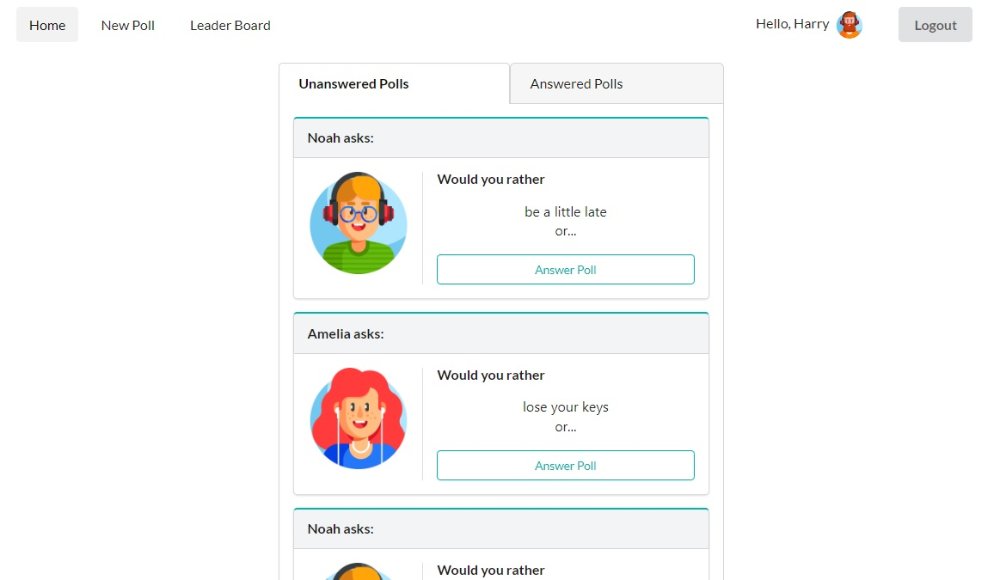

# Would You Rather

Would You Rather is a polling game that presents the user with a series of questions.



It's built with React, Redux, React Router, Redux Thunk & Semantic UI.

## Installation

Clone the repository, go to directories, and use NPM to install the dependencies.

```bash
$ git clone https://github.com/havnat01/reactnd-would-you-rather.git
$ cd reactnd-would-you-rather
$ npm install
```

## Usage

The project can be run with

- `npm start`

The project can be viewed in the browser at

- [http://localhost:3000](http://localhost:3000)
